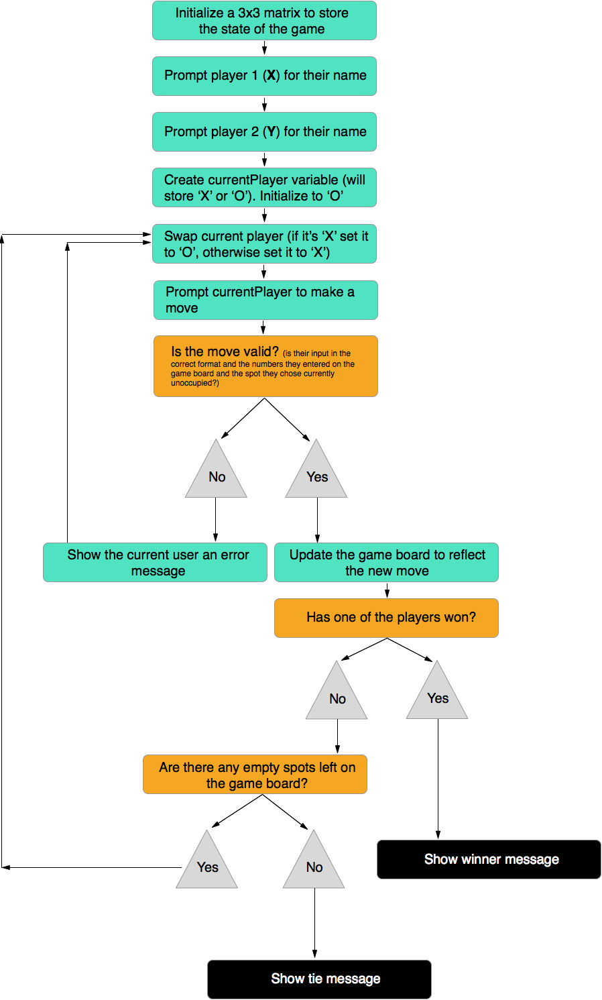

# Tic Tac Toe

## Description
Create a command line tic-tac-toe assignment using JavaScript and node.


## Objectives

### Learning Objectives

After completing this assignment, you should…

* Understand boolean logic
* Understand if statements
* Understand arrays and matricies
* Understand loops


### Performance Objectives

After completing this assignment, you be able to effectively use

* Use a for loop to iterate over an array


## Details

### Deliverables

* A repo containing at least:
  * `main.js`

### Requirements

* No ESHint warnings or errors


## Normal Mode
You will create a two player tic-tac-toe game. The game should start by asking for player one's name and then player two's name. At each stage of the game the current game board should be displayed like so:

```
	    1   2   3
	  ~~~~~~~~~~~~~
	1 |   |   |   |
	  ~~~~~~~~~~~~~
	2 |   |   |   |
	  ~~~~~~~~~~~~~
	3 |   |   |   |
	  ~~~~~~~~~~~~~
```
(this would be an example of a game before that first move has been made)

After displaying the game board your game should prompt the current player for their move. Players will enter their moves int he form of coordinates. For example if a player enters `1 1` then their mark (either X or O) will be placed in the upper left corner. The x (horizontal) coordinate is the first number and the y (vertical) coordinate is the second number that will be entered by the user. For example, `2 1` would place a mark like so:

```
	    1   2   3
	  ~~~~~~~~~~~~~
	1 |   | X |   |
	  ~~~~~~~~~~~~~
	2 |   |   |   |
	  ~~~~~~~~~~~~~
	3 |   |   |   |
	  ~~~~~~~~~~~~~
```

* If a player enters invalid format for their input (ie. there are not two numbers, or they don't separate the numbers with a space) they should be given the error *Invalid input: you must enter the x and y coordinates separated by spaces* and then prompted to enter coordinates again. They should continue to be prompted for coordinates until they don't get an error.
* If a player enters a valid format but the numbers are outside of the game area (for example `1, 4`) they should be given the error *Invalid input: those coordinates are outside the playable area* and then prompted to enter coordinates again. They should continue to be prompted for coordinates until they don't get an error.
* If a player enters a valid format that is inside the game area but there is already a mark in that space they should be give the error *Invalid input: that space is already taken* and then prompted to enter coordinates again. They should continue to be prompted for coordinates until they don't get an error.

After each time a new mark is made on the game board, your game should check to see if there's a winner. If there is, the game should end and it should display a message saying which player won.
            
## Hard Mode
* After a player wins the game should ask if you want to play again, which will start the game over by asking players for their names again.
* At any point if a player types in the word 'forfeit' your game should end and display a message saying that the other play (the one who didn't forfeit) is the winner.
            
## Nightmare Mode
Change your game to be a one player game where you play against a computer AI that never loses.


## Notes

* You will likely need to use the string .split(...) method to get the x and y coordinates from the user input.
* You might want to use parseInt(...) to convert strings to numbers.
* The best way to keep track of the game board is with an array of length three with three arrays inside of it (also length three) that store either an 'X' or 'O' value.
* Below is a flow chart of how the game could be structured



## Additional Resources

* Read []()
